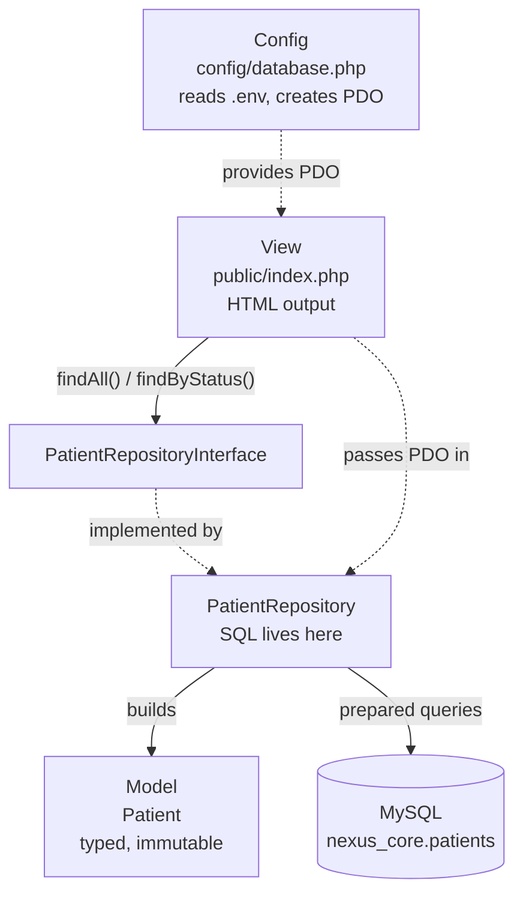
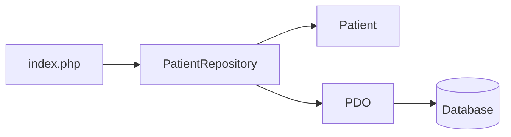
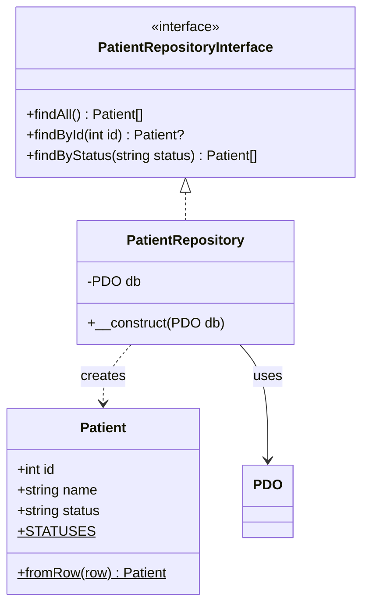
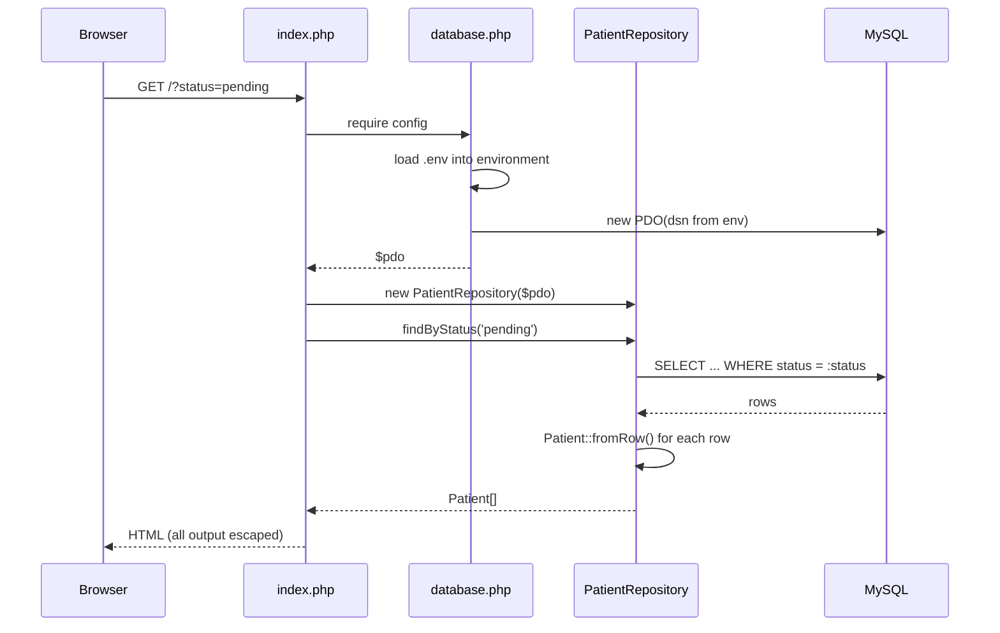
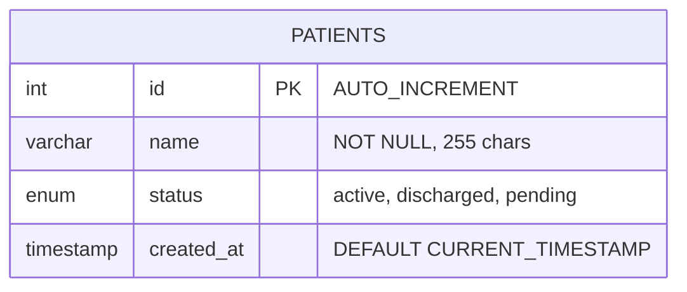
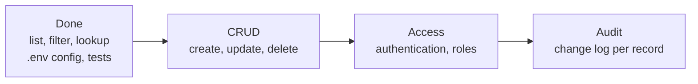

# NexusCore | Healthcare Data Management Backend

A small PHP backend for listing and filtering patient records, built around a **Model + Repository** structure. It shows how to keep SQL out of the page, depend on interfaces instead of concrete classes, and keep credentials out of the codebase, all without a framework.


---

## Table of Contents

1. [Overview](#1-overview)
2. [Architecture](#2-architecture)
3. [How It Works](#3-how-it-works)
4. [Requirements](#4-requirements)
5. [Getting Started](#5-getting-started)
6. [Database Schema](#6-database-schema)
7. [Project Structure](#7-project-structure)
8. [Code Walkthrough](#8-code-walkthrough)
9. [Configuration Reference](#9-configuration-reference)
10. [Testing](#10-testing)
11. [Security Notes](#11-security-notes)
12. [Roadmap](#12-roadmap)
13. [License](#13-license)

---

## 1. Overview

The page asks a repository for patients, and the repository returns typed objects. Only the repository contains SQL.

| Concept | Where it appears |
|---|---|
| Model | `Patient` is an immutable object (`readonly` properties) that validates its status |
| Repository pattern | `PatientRepository` is the only class that contains SQL |
| Programming to an interface | Callers depend on `PatientRepositoryInterface`, so storage can be swapped or faked |
| Dependency injection | The PDO connection is passed into the repository's constructor |
| Prepared statements | Every query that takes input binds parameters |
| Configuration | Database settings come from `.env` / environment variables, never from source |
| Autoloading | PSR-4: `App\` maps to `src/` (built-in loader, or Composer if installed) |

Features: list all patients, filter by status (`active`, `pending`, `discharged`), and look a patient up by id.

---

## 2. Architecture

### 2.1 Layers



### 2.2 Dependencies flow one way



The model knows nothing about the database or the page. The repository knows about the model and PDO but not about HTML.

### 2.3 Class diagram



---

## 3. How It Works

### 3.1 A page request



### 3.2 Bootstrapping

`src/bootstrap.php` registers a PSR-4 autoloader, so classes load the first time they're used. `config/database.php` reads `.env`, builds the DSN, and creates the connection. If the connection fails, the real error goes to the PHP error log and the visitor only sees `Service temporarily unavailable.`

---

## 4. Requirements

- **PHP 8.1+** with `pdo_mysql` (uses `readonly` properties and `str_starts_with`)
- **MySQL or MariaDB**
- Apache, or PHP's built-in server. XAMPP on Windows works out of the box.
- `pdo_sqlite` to run the tests (bundled with most PHP builds)
- Composer is optional

---

## 5. Getting Started

### 5.1 Clone

```bash
git clone https://github.com/JoshuaOmosa/NexusCore.git
cd NexusCore
```

### 5.2 Create the database

Import `database.sql` with phpMyAdmin, or from the command line:

```bash
mysql -u root -p < database.sql
```

This creates `nexus_core`, a `patients` table, and three sample rows.

> **Warning:** the script runs `DROP TABLE IF EXISTS patients` first, so re-importing wipes existing data.

### 5.3 Configure credentials

```bash
cp .env.example .env
```

Then edit `.env` with your database details. `.env` is git-ignored. Any variable already set in the real environment overrides the file, which is how you'd configure a server.

### 5.4 Run it

```bash
php -S localhost:8000 -t public
```

Open `http://localhost:8000/`. Use the links at the top, or `?status=pending`, to filter. On XAMPP you can also use `http://localhost/NexusCore/public/`.

---

## 6. Database Schema



| Column | Type | Notes |
|---|---|---|
| `id` | `INT AUTO_INCREMENT` | Primary key |
| `name` | `VARCHAR(255) NOT NULL` | Patient name |
| `status` | `ENUM('active','discharged','pending')` | Defaults to `active` |
| `created_at` | `TIMESTAMP` | Defaults to the insert time |

Engine `InnoDB`, charset `utf8mb4`. The allowed statuses are also enforced in code by `Patient::STATUSES`.

---

## 7. Project Structure

```text
NexusCore/
├── README.md
├── LICENSE
├── composer.json             # PSR-4 mapping and `composer test`
├── database.sql              # Schema and seed data
├── .env.example              # Copy to .env (git-ignored)
├── config/
│   ├── env.php               # Tiny .env loader + env() helper
│   └── database.php          # Builds the PDO connection from env
├── public/
│   └── index.php             # Entry point and view (only web-facing folder)
├── src/
│   ├── bootstrap.php         # PSR-4 autoloader for App\
│   ├── Models/
│   │   └── Patient.php
│   └── Repositories/
│       ├── PatientRepositoryInterface.php
│       └── PatientRepository.php
└── tests/
    └── run.php               # Dependency-free test runner (SQLite in memory)
```

---

## 8. Code Walkthrough

### `src/Models/Patient.php`

```php
final class Patient
{
    public const STATUSES = ['active', 'pending', 'discharged'];

    public function __construct(
        public readonly int $id,
        public readonly string $name,
        public readonly string $status,
    ) {
        if (!in_array($status, self::STATUSES, true)) {
            throw new \InvalidArgumentException("Unknown patient status: $status");
        }
    }

    public static function fromRow(array $row): self
    {
        return new self((int) $row['id'], (string) $row['name'], (string) $row['status']);
    }
}
```

`readonly` properties make each object immutable once built. `fromRow()` casts explicitly, so the code works under `strict_types` whether the driver returns integers or strings.

### `src/Repositories/PatientRepository.php`

```php
public function findById(int $id): ?Patient
{
    $stmt = $this->db->prepare('SELECT id, name, status FROM patients WHERE id = :id');
    $stmt->execute(['id' => $id]);
    $row = $stmt->fetch(PDO::FETCH_ASSOC);
    return $row ? Patient::fromRow($row) : null;
}
```

Input never gets concatenated into SQL. `findByStatus()` also checks the status against the allowed list before querying.

### `public/index.php`

Validates the `?status=` filter against `Patient::STATUSES` and escapes every value with `htmlspecialchars(..., ENT_QUOTES, 'UTF-8')`. It also shows a message when no patients match and colours each status differently.

---

## 9. Configuration Reference

| Variable | Default | Purpose |
|---|---|---|
| `DB_HOST` | `localhost` | Database host |
| `DB_PORT` | `3306` | Database port |
| `DB_NAME` | `nexus_core` | Database name |
| `DB_USER` | `root` | Database user |
| `DB_PASS` | empty | Database password |

PDO is created with `ERRMODE_EXCEPTION`, `FETCH_ASSOC` as the default fetch mode, real (non-emulated) prepared statements, and `utf8mb4`.

The defaults suit a local XAMPP install. Anywhere else, use a dedicated database user with a password, not `root`.

---

## 10. Testing

```bash
php tests/run.php
# or, with Composer:
composer test
```

The runner needs no packages. It builds an in-memory SQLite table with the same shape as `database.sql` and checks:

- `findAll`, `findById`, and `findByStatus`, including the missing-row and empty-table cases
- that an injection-style status string is rejected
- that `Patient` refuses unknown statuses
- that the `.env` loader parses files, lets real environment variables win, and falls back to defaults

```text
12 passed, 0 failed
```

---

## 11. Security Notes

- **No credentials in the repo.** Settings come from `.env` (git-ignored) or the environment.
- **No SQL injection surface.** Queries with input use bound parameters, and filters are checked against an allow-list.
- **Escaped output.** Every value rendered in HTML is escaped.
- **No error leakage.** Connection failures are logged server-side and shown to visitors as a generic message.
- **Only `public/` is web-facing.** Point the document root there so `config/`, `src/` and `.env` can't be fetched.

This is a demo with sample names. Real patient records fall under regulations such as HIPAA or GDPR and need authentication, encryption, access logging, and secure hosting before use.

---

## 12. Roadmap



- [x] Load configuration from environment variables
- [x] PSR-4 autoloading and `composer.json`
- [x] `PatientRepositoryInterface`
- [x] `findById` / `findByStatus` with prepared statements
- [x] Logged errors with a generic visitor message
- [x] Automated tests
- [ ] `create`, `update`, `delete`
- [ ] Authentication and access control
- [ ] Audit log for record changes

---

## 13. License

MIT. See [LICENSE](LICENSE).
