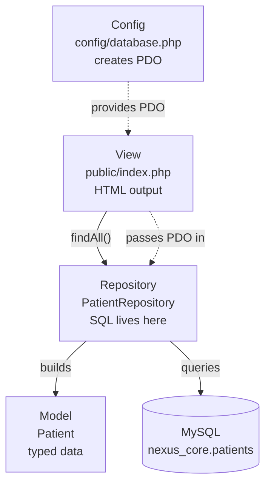
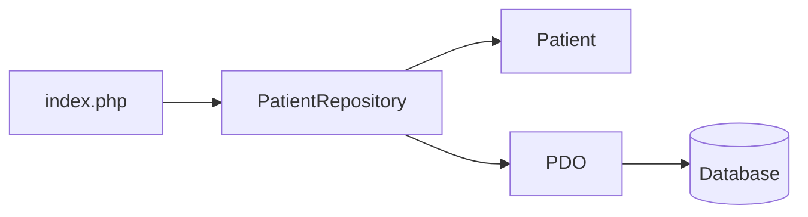
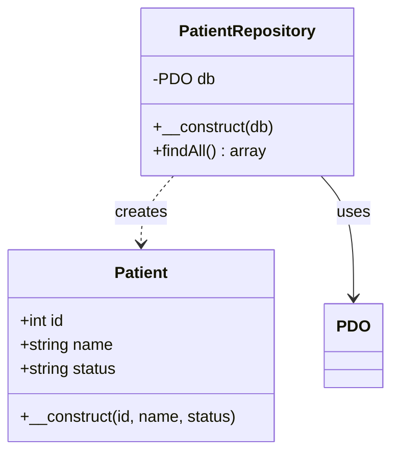
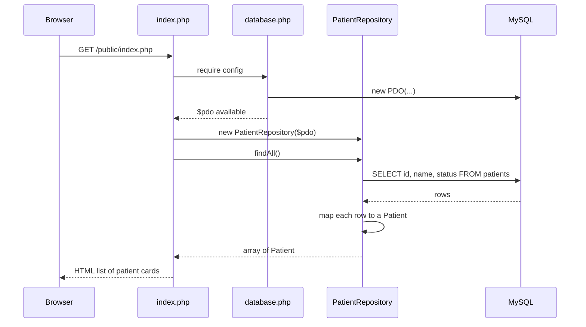
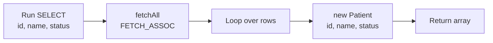
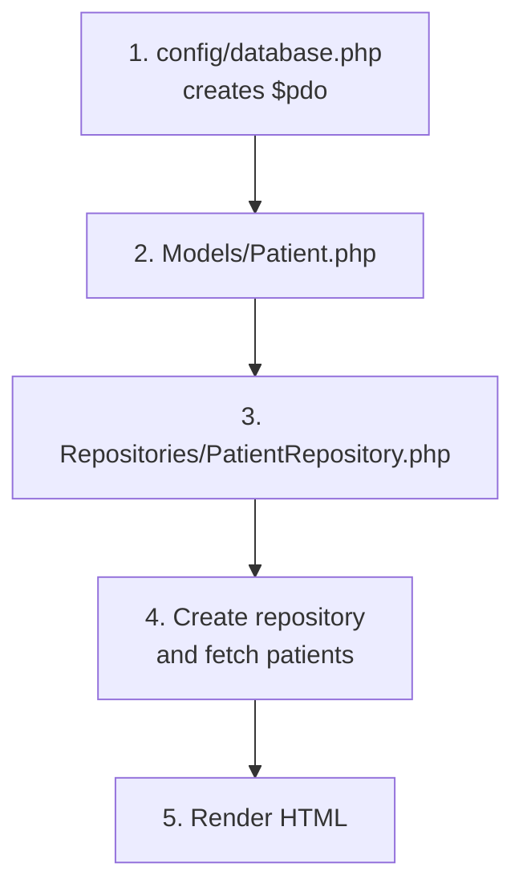
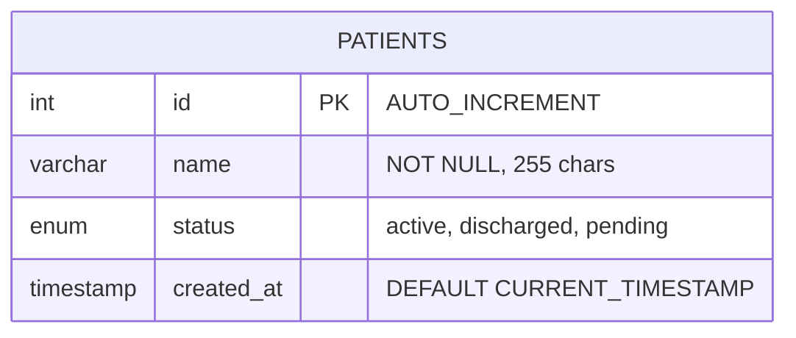
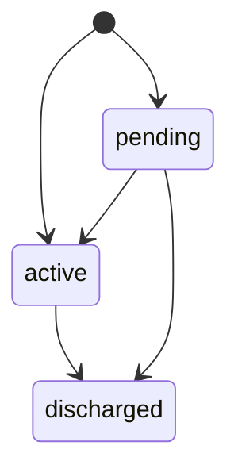
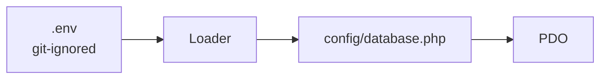
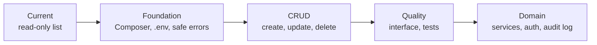

# NexusCore | Healthcare Data Management Backend

A small PHP project that lists patients from a MySQL database using a **Model + Repository** structure. It is a compact showcase of separating data access from presentation, and a starting point for a larger patient-management system.


---

## Table of Contents

1. [Overview](#1-overview)
2. [Architecture](#2-architecture)
3. [How It Works](#3-how-it-works)
4. [Requirements](#4-requirements)
5. [Getting Started](#5-getting-started)
6. [Database Schema](#6-database-schema)
7. [Project Structure](#7-project-structure)
8. [Code Walkthrough](#8-code-walkthrough)
9. [Configuration Reference](#9-configuration-reference)
10. [Design Notes and Known Limitations](#10-design-notes-and-known-limitations)
11. [Suggested Improvements](#11-suggested-improvements)
12. [Roadmap](#12-roadmap)
13. [License](#13-license)

---

## 1. Overview

NexusCore keeps SQL out of the page that displays data. The page asks a repository for patients, and the repository returns typed objects.

| Concept | Where it appears |
|---|---|
| Model | `Patient` holds `id`, `name`, and `status` as typed properties |
| Repository pattern | `PatientRepository` is the only class that contains SQL |
| Dependency injection | The PDO connection is passed into the repository's constructor |
| Separation of concerns | Config, model, data access, and view live in separate files |

Currently the app has one feature: **read-only listing of all patients**.

---

## 2. Architecture

### 2.1 Layers



### 2.2 Dependencies flow one way



The model knows nothing about the database or the page. The repository knows about the model and PDO but not about HTML.

### 2.3 Class diagram



---

## 3. How It Works

### 3.1 A page request



### 3.2 Inside `findAll()`



### 3.3 Bootstrapping

There is no framework or autoloader. `index.php` loads each file by hand, in dependency order:



---

## 4. Requirements

- **PHP 8.x** with the `pdo_mysql` extension (typed properties need 7.4 or newer; the original docs target 8.0)
- **MySQL or MariaDB**
- A web server such as Apache, or PHP's built-in server
- XAMPP on Windows works out of the box, which is the original development setup

---

## 5. Getting Started

### 5.1 Clone

```bash
git clone <your-repo-url>
cd NexusCore
```

### 5.2 Create the database

Import `database.sql` with phpMyAdmin, or from the command line:

```bash
mysql -u root -p < database.sql
```

This creates `nexus_core`, a `patients` table, and three sample rows.

> **Warning:** the script runs `DROP TABLE IF EXISTS patients` first, so re-importing wipes existing patient data.

### 5.3 Configure credentials

Edit the four variables at the top of `config/database.php`:

```php
$host = 'localhost';
$db   = 'nexus_core';
$user = 'root';
$pass = '';
```

The file `senior.env` contains the same values but **is not read by any code** (see [section 10](#10-design-notes-and-known-limitations)).

### 5.4 Run it

Either point Apache's document root at `public/`, or use PHP's built-in server:

```bash
php -S localhost:8000 -t public
```

Then open `http://localhost:8000/`. On XAMPP you can also use `http://localhost/NexusCore/public/`.

### Expected result

A page titled **NexusCore Master List** with one card per patient:

| ID | Name | Status |
|---|---|---|
| 1 | John Doe | active |
| 2 | Jane Smith | pending |
| 3 | Robert Brown | discharged |

If the table is empty the page shows only the heading, with no message.

---

## 6. Database Schema



| Column | Type | Notes |
|---|---|---|
| `id` | `INT AUTO_INCREMENT` | Primary key |
| `name` | `VARCHAR(255) NOT NULL` | Patient name |
| `status` | `ENUM('active','discharged','pending')` | Defaults to `active` |
| `created_at` | `TIMESTAMP` | Defaults to the insert time; not loaded into the model |

Engine `InnoDB`, charset `utf8mb4`.

### Status lifecycle

The schema defines the allowed values but no transitions, so any status can be set to any other:



The arrows above show a *typical* flow, not a rule enforced by code.

---

## 7. Project Structure

```text
NexusCore/
├── README.md
├── database.sql              # Schema and seed data
├── senior.env                # Credentials template (not loaded by any code)
├── senior.gitignore          # Ignore rules (not active, see section 10)
├── config/
│   └── database.php          # Creates the PDO connection
├── public/
│   └── index.php             # Entry point and view
└── src/
    ├── Models/
    │   └── Patient.php       # Patient data object
    └── Repositories/
        └── PatientRepository.php   # Data access
```

| Path | Namespace | Role |
|---|---|---|
| `src/Models/` | `App\Models` | Data objects |
| `src/Repositories/` | `App\Repositories` | SQL and mapping |
| `public/` | none | Only web-accessible folder |
| `config/` | none | Connection setup |

---

## 8. Code Walkthrough

### `src/Models/Patient.php`

```php
namespace App\Models;

class Patient {
    public int $id;
    public string $name;
    public string $status;

    public function __construct(int $id, string $name, string $status) {
        $this->id = $id;
        $this->name = $name;
        $this->status = $status;
    }
}
```

Typed public properties guarantee each field has the expected type once the object exists.

### `src/Repositories/PatientRepository.php`

```php
namespace App\Repositories;

use App\Models\Patient;
use PDO;

class PatientRepository {
    private PDO $db;

    public function __construct(PDO $db) {
        $this->db = $db;
    }

    public function findAll(): array {
        $stmt = $this->db->query("SELECT id, name, status FROM patients");
        $results = $stmt->fetchAll(PDO::FETCH_ASSOC);

        $patients = [];
        foreach ($results as $row) {
            $patients[] = new Patient($row['id'], $row['name'], $row['status']);
        }
        return $patients;
    }
}
```

- The constructor receives the connection instead of creating it, which is the dependency injection.
- `findAll()` converts raw associative arrays into `Patient` objects so callers never see database rows.

### `config/database.php`

Creates a PDO connection with `ERRMODE_EXCEPTION`, stores it in `$pdo` and `$GLOBALS['pdo']`, and stops with `die()` if the connection fails.

### `public/index.php`

Requires the three files, builds the repository with `$pdo`, calls `findAll()`, and loops over the result to print a card per patient. Names are passed through `htmlspecialchars()` before output.

---

## 9. Configuration Reference

| Setting | Value | Where |
|---|---|---|
| DB host | `localhost` | `config/database.php` |
| DB name | `nexus_core` | `config/database.php` |
| DB user | `root` | `config/database.php` |
| DB password | empty | `config/database.php` |
| Charset | `utf8mb4` | DSN in `config/database.php` |
| PDO error mode | Exceptions | `config/database.php` |
| Fetch mode | Associative array | `PatientRepository::findAll()` |

The credentials are development defaults. Do not use an empty-password `root` account outside a local machine.

---

## 10. Design Notes and Known Limitations

I linted every PHP file (no syntax errors) and ran `PatientRepository` and `Patient` against an in-memory SQLite database with the same table shape. It returned three `Patient` objects with the expected values and an empty array for an empty table. MySQL itself was not available, so the live database path is unverified.

How the code compares with what earlier documentation claimed:

- **No autoloader.** Earlier docs said "PSR-4 autoloading compliant". The `App\` namespaces match the folder layout, which is PSR-4-compatible, but there is no `composer.json` and every class is loaded with `require_once`.
- **Strict typing is not enabled.** No file declares `strict_types=1`. Types are declared on properties and parameters, but PHP silently converts values (for example the string `"1"` to `int 1`). If you add `strict_types=1` to the repository on PHP older than 8.1, MySQL integers arrive as strings and the `Patient` constructor will throw a `TypeError`.
- **No prepared statements yet.** Earlier docs said centralized prepared statements reduce SQL injection risk. The only query is a fixed `SELECT` run with `query()` and no parameters. The design supports adding them, but none exist today.
- **Error handling is minimal.** There is one `try/catch`, in `config/database.php`, which prints the raw exception message with `die()`. That message can reveal host and database details to visitors. I saw this output when the driver was missing: `Database connection failed: could not find driver`. The repository has no checks of its own.
- **Not fully database-agnostic.** The repository is typed to `PDO` and there is no repository interface, so swapping storage or mocking in tests would need an interface first. No tests exist.
- **Dependency injection is manual.** `index.php` reads the global `$pdo` set by the config file and wires the repository by hand. There is no container.
- **"DTO" is loose.** `Patient` is a simple data object with public properties; it has no behavior or validation.
- **No business-logic layer.** Earlier docs mentioned one. The project has only model, repository, and view.
- **`senior.gitignore` and `senior.env` do nothing.** Git only reads a file named exactly `.gitignore`, and the app never loads a `.env`. When I staged the folder in a fresh git repository, both files were included. The rules inside would not match `senior.env` anyway. Credentials are actually hardcoded in `config/database.php`.
- **Unescaped status.** `status` is printed without `htmlspecialchars()`. It is limited to three values by the `ENUM`, so the risk is low, but it is inconsistent with how `name` is handled.
- **Every status is styled green.** The `.status` CSS class applies one color regardless of value.
- **No empty state.** With no patients the page shows a heading and nothing else.
- **Read-only.** There is no create, update, or delete.
- **Other gaps:** no `composer.json`, no LICENSE file, and `created_at` is never read.
- **Previous README formatting.** It had no Markdown headers, a stray "Plaintext" label, and duplicate setup sections. This document replaces it.

---

## 11. Suggested Improvements

### 11.1 Add Composer autoloading

```json
{
    "autoload": {
        "psr-4": { "App\\": "src/" }
    }
}
```

Run `composer dump-autoload`, then replace the two `require_once` lines for classes in `index.php` with `require __DIR__ . '/../vendor/autoload.php';`.

### 11.2 Extract an interface

```php
namespace App\Repositories;

use App\Models\Patient;

interface PatientRepositoryInterface {
    /** @return Patient[] */
    public function findAll(): array;
    public function findById(int $id): ?Patient;
}
```

Type-hint the interface in calling code so tests can supply a fake.

### 11.3 Add a lookup with a prepared statement

```php
public function findById(int $id): ?Patient {
    $stmt = $this->db->prepare(
        "SELECT id, name, status FROM patients WHERE id = :id"
    );
    $stmt->execute(['id' => $id]);
    $row = $stmt->fetch(PDO::FETCH_ASSOC);

    return $row
        ? new Patient((int) $row['id'], $row['name'], $row['status'])
        : null;
}
```

The `(int)` cast keeps this safe if you later enable `strict_types`.

### 11.4 Stop leaking connection errors

```php
} catch (PDOException $e) {
    error_log($e->getMessage());
    http_response_code(500);
    die("Service temporarily unavailable.");
}
```

### 11.5 Load credentials from the environment

Rename `senior.env` to `.env` and `senior.gitignore` to `.gitignore`, then read the values with a loader such as `vlucas/phpdotenv`, so credentials stay out of version control:



### 11.6 Small view fixes

```php
<span class="status status-<?= htmlspecialchars($p->status) ?>">
    <?= htmlspecialchars($p->status) ?>
</span>
```

Then add CSS classes per status, and show a message when `$patients` is empty.

---

## 12. Roadmap



- [ ] Rename `senior.env` and `senior.gitignore` so they take effect
- [ ] Add `composer.json` with PSR-4 autoloading
- [ ] Load configuration from environment variables
- [ ] Replace `die()` with logged errors and a generic message
- [ ] Add `PatientRepositoryInterface`
- [ ] Add `findById`, `create`, `update`, `delete` using prepared statements
- [ ] Add PHPUnit tests
- [ ] Add authentication and access control
- [ ] Add an audit log for record changes
- [ ] Add a LICENSE

### A note on healthcare data

This is a demo with sample names. Real patient records fall under privacy regulations such as HIPAA or GDPR and need authentication, encryption, access logging, and secure hosting before use.

